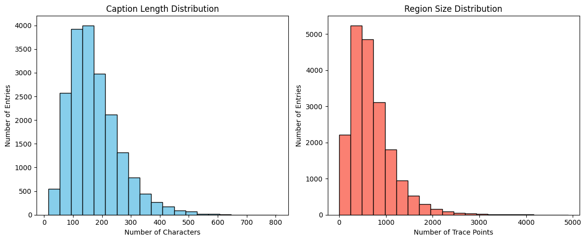
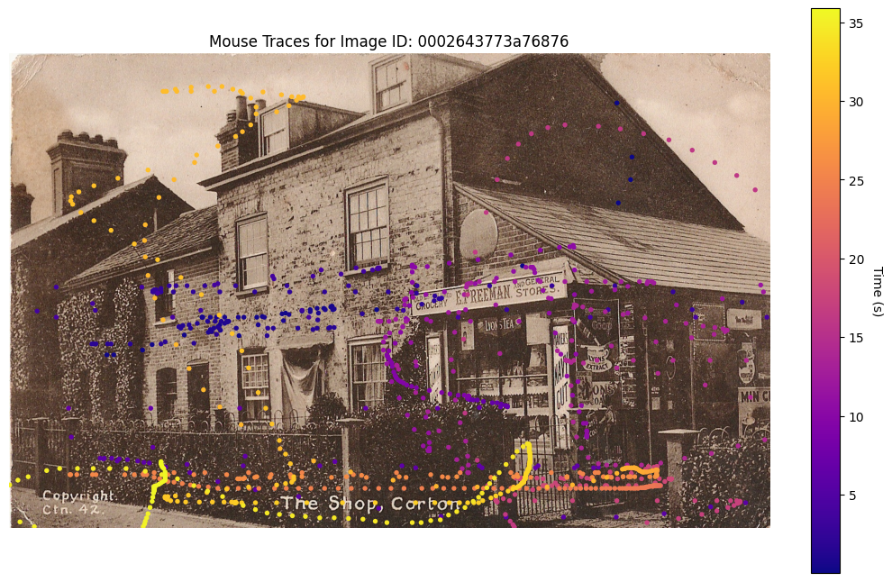
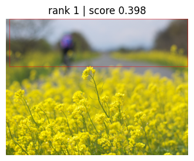
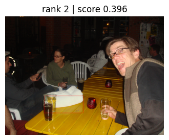
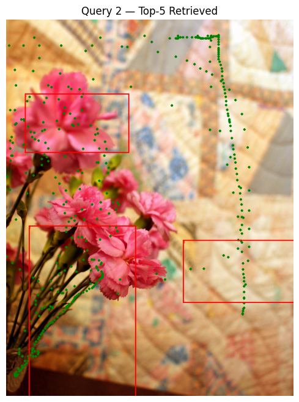
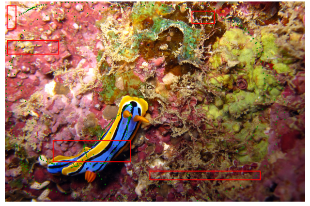
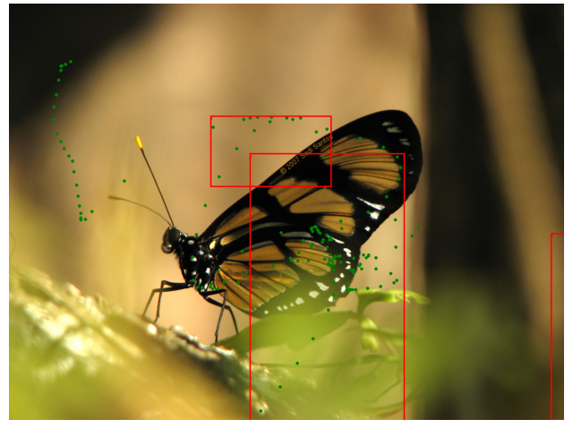

# Technical Report on a Prototype System for Graphic Retrieval Based on OID Localized Narratives

本项目基于 Open Images Dataset V7 (Localized Narratives) 构建了一个图文检索原型系统，实现了根据文本查询（query）检索相关的图像区域的功能。  

---

## 目录
- [一、数据集](#一数据集)
  - [1.1 数据集采样](#11-数据集采样)
  - [1.2 数据集清洗](#12-数据集清洗)
  - [1.3 数据集划分](#13-数据集划分可选)
  - [1.4 数据集可视化与分析](#14-数据集可视化与分析)
- [二、多模态嵌入技术调研和模型选择](#二多模态嵌入技术调研和模型选择)
  - [2.1 多模态嵌入模型调研](#21-多模态嵌入模型调研)
    - [2.1.1 CLIP](#211-clip)
    - [2.1.2 ALIGN](#212-align)
  - [2.2 模型选择](#22-模型选择)
- [三、系统评估指标](#三系统评估指标)
  - [3.1 评估指标概述](#31-评估指标概述)
  - [3.2 评估指标的定义与计算方法](#32-评估指标的定义与计算方法)
- [四、实验](#四实验)
  - [4.1 文本特征提取方法](#41-文本特征提取方法)
  - [4.2 检索系统](#42-检索系统)
  - [4.3 效果评估](#43-效果评估)
- [五、总结与展望](#五总结与展望)

---

## 一、数据集

Open Images Dataset 是由 Google 发布的一个大规模开放图像数据集，最早于 2016 年发布，至 V7（即第七版）为止已经成为全球最大的公开可用多标签图像数据集之一。
它包含超过 900 万张图像，涵盖数千个类别的标签，主要包括：
- **图像级标签**：为整张图像标注类别标签，帮助模型理解图像的整体语义。
- **边界框**：为图像中的每个物体实例提供矩形框标注，包括物体类别与位置。
- **分割掩膜**：对图像中的物体进行像素级别的精细分割，适用于语义分割与实例分割任务。
- **视觉关系**：描述图像中物体之间的关系（例如：骑在马上、坐在桌子旁），用于关系推理和场景理解。
- **局部化叙述（Localized Narratives）**：结合图像、文本和用户指点轨迹的多模态数据，支持多模态时空对齐和视觉-语言-行为交互研究。
- **人脸标注**：对图像中的人脸区域进行标注，包括年龄、性别、情绪等辅助信息（某些版本可能存在）。
- **层级和属性标签**：记录类别之间的层级关系，以及颜色、材质等附加属性。

Localized Narratives 是 Open Images V7 的重要扩展之一，旨在将“看”（图像内容）、“说”（口述描述）与“指”（注视或指点轨迹）结合起来。该扩展集在部分 Open Images 图像上，记录了人工口述描述的同时，也采集了用户在指点图像时的轨迹，形成了一个多模态同步数据集。
其内部主要组成部分有：
- **image_id**：图像唯一标识
- **caption**：完整的口述描述文本。
- **time_caption**：文本分解为若干个小的 utterance，并记录对应的开始、结束时间戳。
- **traces**：在每个 utterance 期间，用户手动（或光标）指向图像的轨迹点x, y和t。

### 1.1 数据集采样
完整的Localized Narratives包含507,444张训练集，41,691张验证集和126,020张测试集。其中训练集由于过于庞大被划分成了10组数据供于下载。但由于设备和实验规模限制，此次只采用了训练集中的第一组数据作为全部实验数据。

这组数据集（JSONL文件）共包含50,980条数据。通过 image_id 匹配 csv 表格后批量下载，共获得 19,354 张有效图像。

### 1.2 数据集清洗
根据有效图片数据清洗JSONL文件。
- 保留有效图片对应的标注
  - 仅保留在图像文件夹中实际存在的图像 ID所对应的标注条目，剔除因下载不完整或数据缺失而产生的孤立标注。
- 轨迹时间范围过滤
  - 只保留时间戳在当前 timed_caption 的首尾时间范围内的轨迹点，去除由于采集设备问题或标注延迟产生的冗余点，确保轨迹与叙述的同步性。
-  轨迹空间范围过滤
  - 删除所有超出图像边界的轨迹点，避免图像范围之外的轨迹点干扰可视化和模型训练。
- 空轨迹处理
  - 如果某一条 timed_caption 对应的 traces 经过上述过滤后为空（即没有保留点），则将其 traces 设为空列表以保持数据结构完整。
- 结果保存
  - 清洗完成后，将保留的条目存储为新的 JSON 文件（filtered_original_train.jsonl），方便后续调用。

### 1.3 数据集划分（可选）
由于Localized Narratives的validation和test图像数据下载访问受限，因此根据完整数据集比例，即507444：41691：126020的比例对19354份有效数据随机打乱后进行数据集划分。
- 按 75%:6%:19% 的比例划分后的数据集：
  - 训练集：14,515
  - 验证集：1,161
  - 测试集：3,678

### 1.4 数据集可视化与分析

  

  <b>图一：</b>数据长度分布直方图（左）和区域大小分布直方图（右，以总轨迹点数为单位）

从结果可以看出：左图中可看出长度范围从 ~20 字符到 ~800 字符不等。大多数叙述落在 80–250 字符区间，峰值约在 150 字符左右，少量样本较长。右图中可以看出轨迹点数从几十点到 5,000 点不等。峰值约在 400–900 个点之间，最频繁范围约 500–600 点。
综合两张图对比可以发现，两者均服从var相似的正态分布。以其mean相比可以得出，caption长度和轨迹点数呈现约为1：3.5的比例。即，一个词大约需要3.5个点表示。

  
  

  <b>图二：</b>时间序列下的轨迹点热力图

---

## 二、多模态嵌入技术调研和模型选择

### 2.1 多模态嵌入模型调研
多模态嵌入模型用于将图像和文本信息嵌入到共享的向量空间，实现跨模态检索。

#### 2.1.1 CLIP
CLIP 由 OpenAI 提出，通过对数亿的图文对进行对比训练，学习到了强大的图文对齐能力。

CLIP 利用一对图像和文本作为正样本，并将其他不相关的图文对作为负样本，使用对比损失（InfoNCE）最大化正样本在嵌入空间的相似度，最小化负样本的相似度。图像通常使用 Vision Transformer（ViT）或 ResNet 提取特征，文本使用 Transformer进行编码，最终投影到相同维度的多模态嵌入空间中。

CLIP的优势在于：
- 无需人工标注的区域级对齐，只需图像-文本对即可训练；
- 大规模预训练使其具备出色的跨模态检索和零样本分类能力；
- 模型具备较好的可扩展性和泛化性。

在图文检索任务中的应用，CLIP 的嵌入空间可以直接用于图文检索任务。将查询文本嵌入到共享空间，与图像嵌入计算余弦相似度，检索到最相关的图像。反之亦然，可通过图像检索描述文本。

#### 2.1.2 ALIGN
ALIGN 是由 Google 提出的一种大规模多模态预训练方法，进一步扩展了数据规模和多模态对比学习的能力。

ALIGN 同样采用了对比学习框架，但其最大的特点是使用了大规模的噪声文本与图像配对的数据进行训练。模型分别使用 EfficientNet 作为图像编码器，以及 BERT 作为文本编码器，将两种模态投影到同一个向量空间，通过对比损失训练跨模态的相似性。

ALIGN的优势在于：
- 支持极大规模的训练数据，有效提升模型的多样性和鲁棒性；
- 对于噪声数据的强大容忍度，避免了数据清洗的高成本；
- 具有更强的可扩展性，适用于多语言和多领域的检索任务。
  
在图文检索任务中的应用，ALIGN 通过大规模预训练获得了良好的跨模态检索能力，能够在海量图片库中快速检索到与查询文本语义最匹配的图像，反之亦然。此外，ALIGH在多语言检索和复杂场景下表现优异，并且能够支持零样本检索等下游任务。

### 2.2 模型选择
- 本项目选择了 CLIP 模型，因其更轻量，适合本地实验。

---

## 三、系统评估指标

### 3.1 评估指标概述

本图文检索系统使用多种指标对性能进行全面评估，主要包括：  

- **Precision@K (P@K)**：衡量在 Top-K 返回结果中，正确检索到的比例。
- **Recall@K (R@K)**：衡量 Ground Truth 是否在 Top-K 中被检索到。
- **Mean Average Precision (MAP)**：综合评估检索结果的排序质量。
- **Normalized Discounted Cumulative Gain (NDCG)**：反映相关结果在检索排名中的位置优劣。
- **PointCoverage@K**：衡量预测区域对实际轨迹点的覆盖情况。

鉴于此次任务图像区域GT为鼠标轨迹点，传统图文检测评估标准效果不行明显，因此主要采用 **PointCoverage@K**，即预测区域内轨迹点数所占比例。

### 3.2 评估指标的定义与计算方法

#### 3.2.1 Precision@K (P@K)
表示 Top-K 候选结果中，IoU 超过阈值（默认为 0.5）的候选区域的比例。
$$P@K = \frac{\text{Top-K 中命中的数量}}{K}$$

#### 3.2.2 Recall@K (R@K)
表示在 Top-K 候选结果中，是否至少有一个候选区域与 Ground Truth 命中（IoU ≥ 阈值）。  
如果 Top-K 中至少有一个命中，则 R@K = 1；否则 R@K = 0。

#### 3.2.3 Mean Average Precision (MAP)
表示模型在不同查询上的平均检索性能，衡量正确结果的排名情况。
$$MAP = \frac{1}{N} \sum_{i=1}^{N} \frac{1}{rank_i}$$
其中 $rank_i$ 是第一个正确结果的排名（1-based）。

#### 3.2.4 Normalized Discounted Cumulative Gain (NDCG)
衡量正确结果在检索排序中的重要性，排名越靠前奖励越高。
$$DCG@K = \sum_{i=1}^{K} \frac{rel(i)}{\log_2(i+1)}$$
由于通常只有一个正确结果，IDCG=1，因此：
$$NDCG@K = \frac{DCG@K}{IDCG@K}$$

#### 3.2.5 PointCoverage@K
衡量预测区域对 Ground Truth 轨迹点的覆盖率（相对所有轨迹点）。
$$PointCoverage@K = \max_{r \leq K} \frac{\text{区域内点数}}{\text{总点数}}$$

---

## 四、实验

### 4.1 文本特征提取方法

为了对 caption 进行向量化表示，实验使用了Sentence-BERT（all-MiniLM-L6-v2）作为文本特征提取器。其输入是 caption 文本，输出是一个 384 维的上下文相关文本向量。为了与图像区域的向量维度保持一致，使用了一个线性层将 384 维投影到 512 维。

具体来说：
  - 模型加载：HuggingFace 的 AutoTokenizer 和 AutoModel。
  - mean pooling：对每个 token 的输出进行 mask-based mean pooling。
  - 投影层：一个 384 → 512 的线性变换（无偏置）。
  - 归一化：对向量进行 L2 normalization，方便计算余弦相似度。

### 4.2 检索系统

模型采用了 Caption→Image Region 的检索流程。

- 离线索引构建：
  - 依次遍历 JSONL 文件的每个 entry。
  - 通过 traces_to_bbox() 将轨迹点转换为像素级 bbox，并裁剪图像。
  - 对每个 bbox 区域提取 caption 的向量化特征，并构建 Annoy 索引（Angular metric）。
  - 同时保存 metadata（包括 image_path, bbox, caption）。
    
- 在线检索：
  - 对查询的 caption 进行向量化（同上）。
  - 在 Annoy 索引中检索 Top-K 区域。
  - 返回检索结果，包括 image_path、bbox 及匹配分数。

### 4.3 效果评估

在本任务中，检索任务被划分为两种场景：
- 全局队列检索：输入查询文本在整个图像区域的检索数据库中进行匹配，旨在评估跨图像的全局检索能力。
- 图像局部检索：输入查询文本仅在对应 caption 关联的图像的候选区域中进行检索，旨在验证模型在图像内部的局部语义对齐和目标检测能力。

#### 4.3.1 全局检索

  
  

  <b>图三：</b>全局队列检索结果图

在全局检索场景下，输入的查询文本为 "a butterfly on a yellow flower"，该文本并未直接来源于数据集中某一特定图像的标注。模型的 Rank-1 结果显示，与检索文本的语义高度匹配，尤其准确地检测到了 "yellow flower" 这一关键概念。同时，模型在预测区域中也较好地捕捉到了 "on" 的空间关系，展示了较强的跨图像检索能力。然而，Rank-2 结果尽管分数相近，却仅部分匹配到了 "on a yellow" 片段，未能完整地复现查询文本的全部语义，揭示了模型在排序精度上的潜在改进空间。

#### 4.3.2 局部检索

  
  
  

  <b>图四：</b>图像局部检索结果图

在局部检索场景下，我们评估了模型在指定图像及对应 caption 上的检索性能。结果表明，模型具备一定的局部检索能力，能够在图像的局部区域中捕捉到 caption 中的关键字段。然而，由于轨迹点较为分散，模型在检测区域的边界预测上仍存在不足，未能完全覆盖所有目标区域。PointCoverage@5 仅为 0.3506，反映出模型尚未充分检测到所有目标区域的位置，提示在局部检索任务中仍有优化空间。

---

### 五、总结与展望

本项目初步构建了基于 OID Localized Narratives 的图文检索原型系统，探索了多模态模型在全局与局部检索任务中的性能表现。实验结果表明，模型在全局检索场景中能够较好地匹配查询文本的语义，在局部检索中也能捕捉到 caption 中的关键字段。然而，在轨迹点分散及复杂场景下，模型在 PointCoverage 等指标上仍存在性能不足。

后续工作可从以下方向进行深入研究：
- 对预训练模型进行微调（fine-tuning），以提升模型在目标检索任务上的特定性能。
- 设计更符合轨迹检测的分类头模块，优化模型对稀疏或分散轨迹点的检测能力。
- 结合多模态注意力机制，提升模型的跨模态对齐与区域检测的精度。
